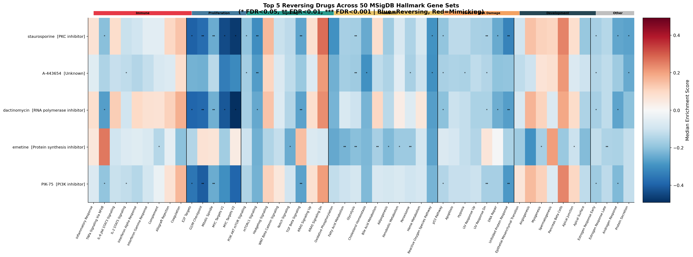
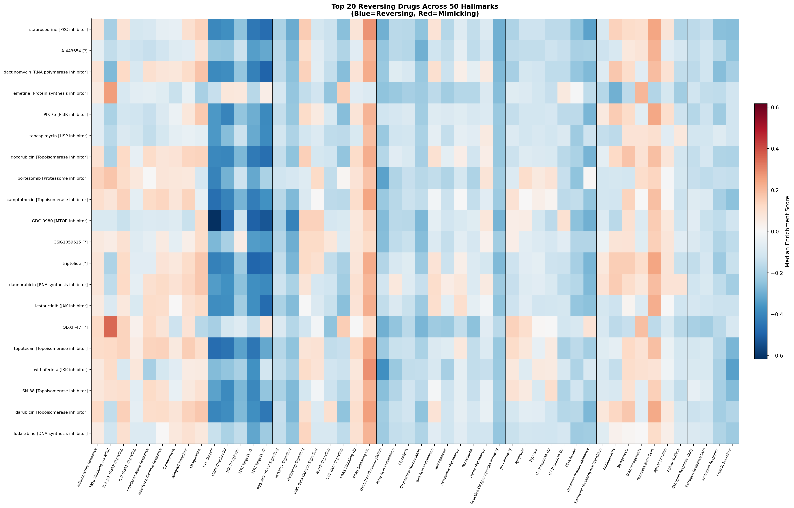
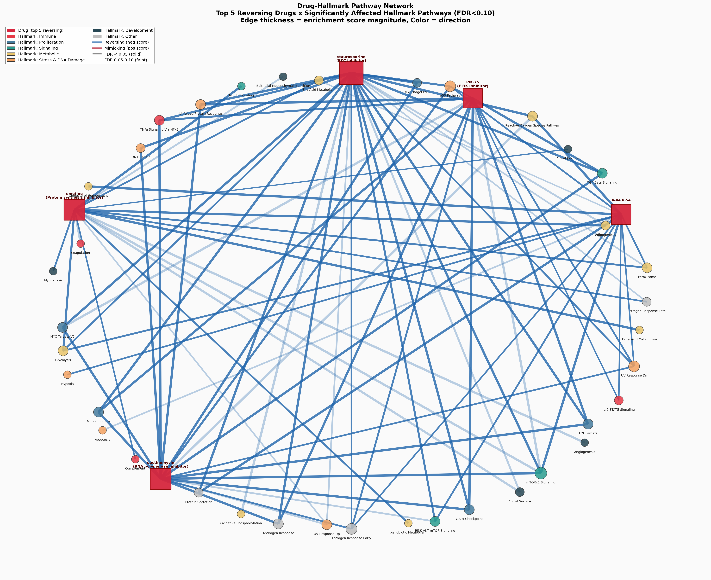

# Showcase — 50 MSigDB Hallmarks

This is a complete, **pre-computed** worked example that ships in the repository. It runs the clue-mcp engine against **all 50 [MSigDB Hallmark](https://www.gsea-msigdb.org/gsea/msigdb/human/genesets.jsp?collection=H) gene sets**, aggregates the results into a single drug × pathway matrix, and renders a cross-pathway heatmap and a drug ↔ hallmark network.

It doubles as (1) a genuinely useful broad-spectrum drug screen and (2) a demonstration of how to scale the engine to many parallel queries.

!!! success "No database build required to look"
    The output tables and figures below are committed under
    [`analysis/hallmark_enrichment/`](https://github.com/swaruplab/clue-mcp/tree/main/analysis/hallmark_enrichment).
    You can browse the full results without downloading the 9 GB database — you
    only need the database to *re-run* it.

---

## What it does

For each of the 50 Hallmark gene sets:

1. Loads the gene list from MSigDB (cached in [`data/msigdb/h.all.v2026.1.Hs.json`](https://github.com/swaruplab/clue-mcp/tree/main/data/msigdb)).
2. Maps gene symbols onto the L1000 12,328-gene panel.
3. Calls `CMapEngine.query_enrichment(...)` against every drug signature.
4. Runs **10,000 permutations** of size-matched random gene sets for empirical p-values.
5. Applies Benjamini–Hochberg FDR correction across all drug–hallmark pairs.

Then, across all 50 hallmarks, it aggregates into a **511-drug × 50-hallmark** matrix, ranks drugs by a composite of effect size and breadth, and renders the figures below. Total runtime: **~12 minutes on 8 cores**.

---

## Headline result

The five most broadly **signature-reversing** compounds across all 50 Hallmarks:

| Rank | Compound | MOA | Target | Significant hallmarks (FDR < 0.05) |
|------|----------|-----|--------|:----------------------------------:|
| 1 | **staurosporine** | PKC / CDK inhibitor | CDK2 | 18 |
| 2 | **A-443654** | AKT inhibitor | — | 12 |
| 3 | **dactinomycin** | RNA polymerase inhibitor | POLR2A | 14 |
| 4 | **emetine** | Protein-synthesis inhibitor | RPS2 | 11 |
| 5 | **PIK-75** | PI3K inhibitor | PIK3CA | 11 |

**Proliferation** Hallmarks (E2F Targets, MYC Targets, G2/M Checkpoint) were the most consistently reversed; **immune** Hallmarks were predominantly *mimicked* (positive WTCS). This is the expected fingerprint of broadly cytostatic compounds — useful as a sanity check that the scoring behaves sensibly.

---

## Cross-pathway heatmap

Top drugs × all 50 Hallmarks, columns grouped by biological category (immune, proliferation, signaling, metabolic, development, stress/DNA-damage). Blue = reversal, red = mimicry.



A wider view including the top 20 drugs:



---

## Drug ↔ Hallmark network

Bipartite network linking drugs to the Hallmarks they significantly reverse; edge weight encodes significance. Hub drugs reverse many pathways at once.



---

## Outputs

```text
analysis/hallmark_enrichment/
├── per_hallmark/                         # one folder per Hallmark
│   └── HALLMARK_E2F_TARGETS/
│       ├── all_signature_scores.csv
│       ├── drug_level_summary.csv
│       ├── top50_reversing_signatures.csv
│       └── top50_mimicking_signatures.csv
├── aggregated/
│   ├── cross_hallmark_drug_matrix.csv    # drugs × 50 Hallmarks score matrix
│   ├── top5_drugs_summary.csv
│   └── hallmark_statistics.csv
├── plots/
│   ├── master_heatmap.png
│   ├── expanded_heatmap_top20.png
│   └── drug_hallmark_network.png
└── summary.txt
```

---

## Reproduce or adapt it

Once you have the [database built](pipeline.md):

```bash
# On SLURM (~12 min, 8 cores, 64 GB RAM)
sbatch analysis/hallmark_enrichment/slurm_run.sh

# …or locally
python analysis/hallmark_enrichment/run_hallmark_enrichment.py
```

To point the same workflow at a **different gene-set collection** (KEGG, GO BP, Reactome, or your own), edit `run_hallmark_enrichment.py`:

1. Replace `MSIGDB_URL` / `MSIGDB_JSON` with your gene-set source.
2. Update the `HALLMARK_CATEGORIES` dict if you want biological column groupings.
3. Adjust `TOP_DRUGS` to widen the master heatmap.

---

## Next steps

- [Method & data](method.md) — what the WTCS and the permutation FDR actually compute.
- [Running an analysis](usage.md) — the single-signature driver these per-hallmark runs are built on.
